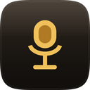
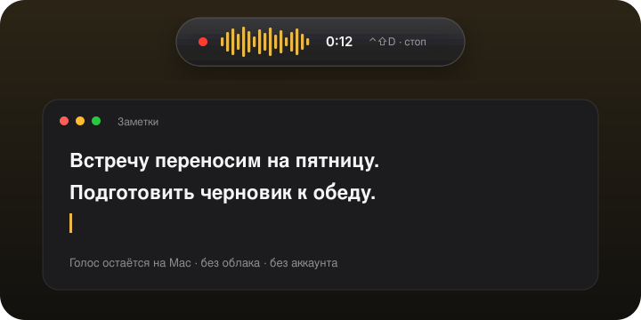

# Dictator

**Говорите — текст появляется.** Модель на компьютере. Голос никуда не уходит.

Speak — the text appears. On-device Russian STT. No cloud, no account.

**Офлайн** · **Русский** · **Без аккаунта** · **macOS 12+ · Apple Silicon** · **Windows 10+ x64**

  

**[Скачать](https://github.com/LenarBad/dictator/releases/latest)** — Mac: `Dictator-macos-aarch64.app.zip`; Windows: `Dictator-windows-x64.exe` (около 250 МБ, программа и модель вместе).

`⌃⇧D` / `Ctrl+Shift+D` начинает запись. Сверху экрана бежит волна. Ещё раз — текст в активном поле.

Распознавание: [GigaAM-v3](https://github.com/salute-developers/GigaAM) (Sber, MIT), полностью на компьютере. Оболочка — [Tauri 2](https://tauri.app), Python не нужен. Intel Mac, Windows ARM и Linux — позже.

## Как пользоваться

Поставьте курсор в поле и нажмите хоткей. Говорите. Нажмите ещё раз — или кликните по индикатору сверху.

| Действие | Как |
|---|---|
| Старт / стоп | `ctrl+shift+d`, пункт меню иконки или клик по индикатору |
| Настройки | Меню иконки → «Настройки…» |
| Только копировать | В настройках выключите авто-вставку |
| Выход | Меню иконки → «Выход» |

Иконки в Dock / на панели задач нет — Dictator в **строке меню** (Mac) или **трее** (Windows). Запись длиннее ~25 с режется на чанки. На Mac не назначайте `ctrl+space`: система забирает его на смену языка.

Настройки пишутся сразу, без кнопки «Сохранить». Раздел «Разрешения» прячется, когда доступы уже выданы.

## Установка

### Mac

Чип **Apple** (M1–M4), **macOS 12+**. Intel пока не собираем.

1. Скачайте `Dictator-macos-aarch64.app.zip` из [Releases](https://github.com/LenarBad/dictator/releases/latest)
2. Перетащите `Dictator.app` в **Программы**
3. Первый запуск: правый клик → **Открыть** (ad-hoc подпись, Gatekeeper предупредит). Не жмите **Move to Trash**
4. Включите **Микрофон** и **Универсальный доступ** для `/Applications/Dictator.app`

Запускайте копию из «Программ», не из «Загрузок».

### Windows

**Windows 10 1809+ x64.** ARM64 не собираем.

1. Скачайте `Dictator-windows-x64.exe` из [Releases](https://github.com/LenarBad/dictator/releases/latest)
2. SmartScreen: **Подробнее** → **Выполнить в любом случае** (подписи Authenticode нет)
3. В **Параметрах → Конфиденциальность → Микрофон** разрешите Dictator

После установки приложение **не ходит в интернет**.

Подробно и FAQ: **[docs/INSTALL.md](docs/INSTALL.md)**. Сборка из исходников (Mac): **[docs/BUILD.md](docs/BUILD.md)**. Угрозы: **[SECURITY.md](SECURITY.md)**. Заметки по Windows: **[docs/WINDOWS.md](docs/WINDOWS.md)**.

## English

Offline Russian dictation: speak, and the text is pasted into the focused field. Recognition runs on-device with [GigaAM-v3](https://github.com/salute-developers/GigaAM) (MIT). **macOS 12+ on Apple Silicon and Windows 10 1809+ x64.**

Download from [Releases](https://github.com/LenarBad/dictator/releases/latest): `Dictator-macos-aarch64.app.zip` or `Dictator-windows-x64.exe`. The Mac build is ad-hoc signed, so Gatekeeper will warn; on Windows, SmartScreen will warn (no Authenticode). Enable the microphone (and on Mac, Accessibility). A recording pill appears at the top of the screen while you speak.

Full install steps (Russian): [docs/INSTALL.md](docs/INSTALL.md). Threat model: [SECURITY.md](SECURITY.md). Once installed, the app does not contact the network.

## Лицензия

[MIT](LICENSE), © 2026 [LenarBad](https://github.com/LenarBad).  
Сторонние компоненты: [THIRD_PARTY_NOTICES.md](THIRD_PARTY_NOTICES.md).
